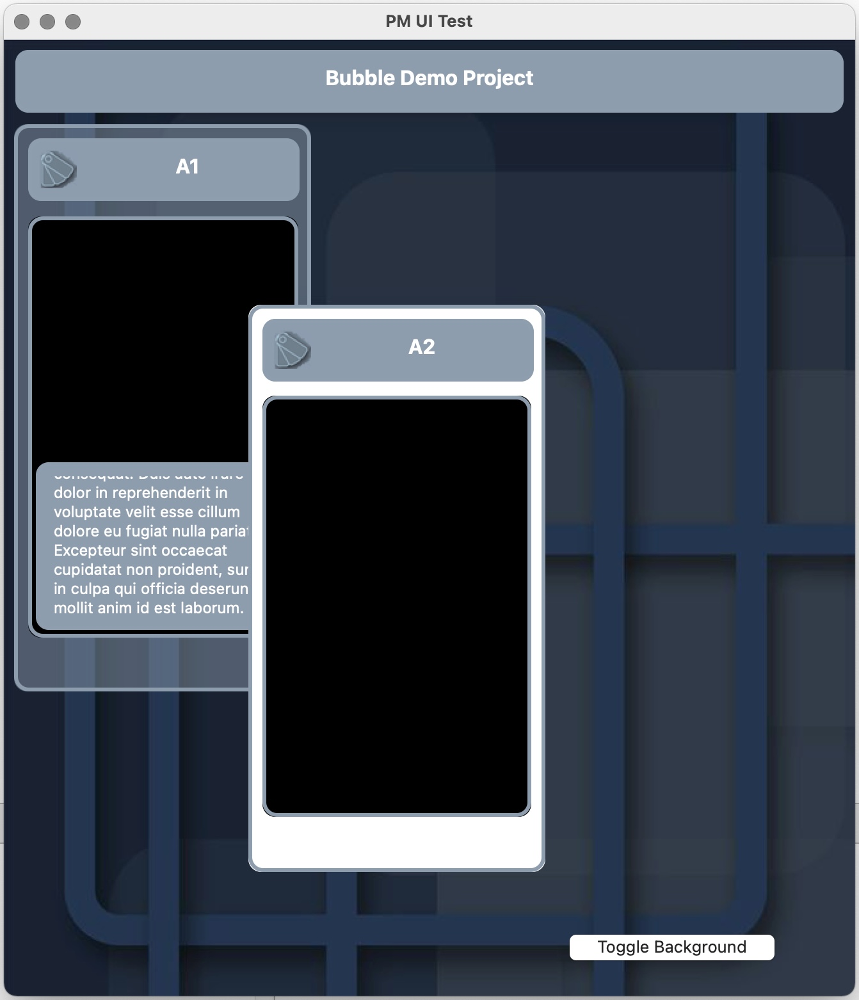
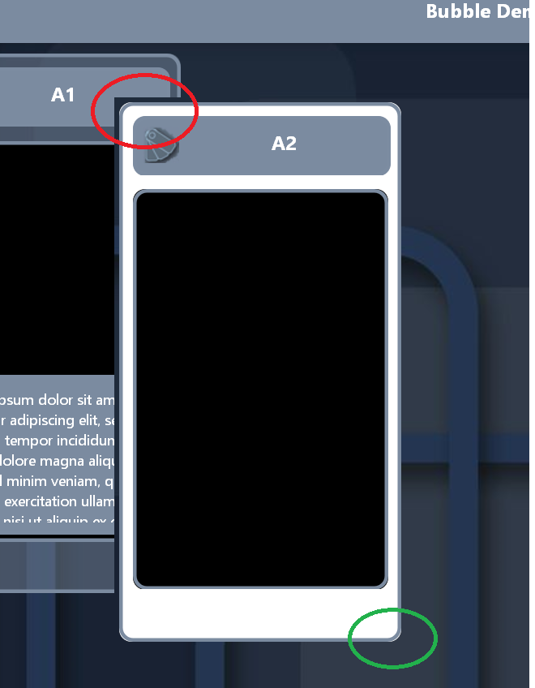

# PM-UI

We developed an app in 2019 - which took now about 2 years. At the beginning we made some proof-of-concept studies. These also included some tests of the UI capabilities. Now, after a bit more than two years and a few Xojo- and Windows releases later nothing works any more like it should. In fact we will not deliver a Windows version because it would be too embarrassing. 

Here you see an image of the Mac-Version of one of our UI tests - very nice:

Using the WIndows Version it looks different first:

A bit strange is that transparency works at the background, but not at the overlapping part (red bubble). OK, that would not be too problematic - if we make compromises. We can see, that the app works fine on the Mac - but on the PC moving bubbles around jerks. Also if you click into a bubble it takes about a second until the selected bubble lights up.

**If you switch off the background - IT WORKS again!**

We prepared a small sample App, which allows moving and selecting one of two bubbles. Simply drag the bubble with the mouse after opening. Do it fast. Select either bubble. Do it again. Now check out Mac and Windows. Old Windows 10 and Windows 7 will do. Newer versions NOT. Something has changed - and not to the better. If you use the button "Toggle Background" you will see the difference. 

I do not know if this is a Windows issue or if this is Xojo. It may even be possible that I made something really stupid or unneccessary steps. What was changed since the first test is, that "double buffering" thing is gone and now "composited" is there. May be it has something to do with that. May be not.